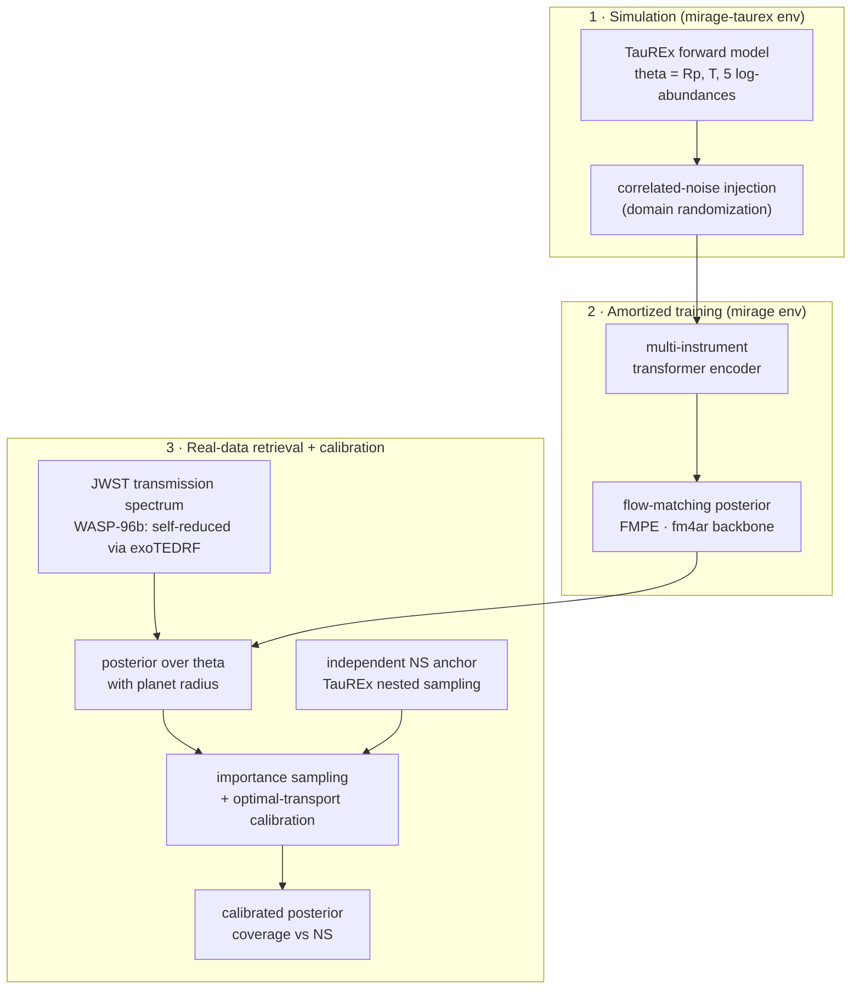
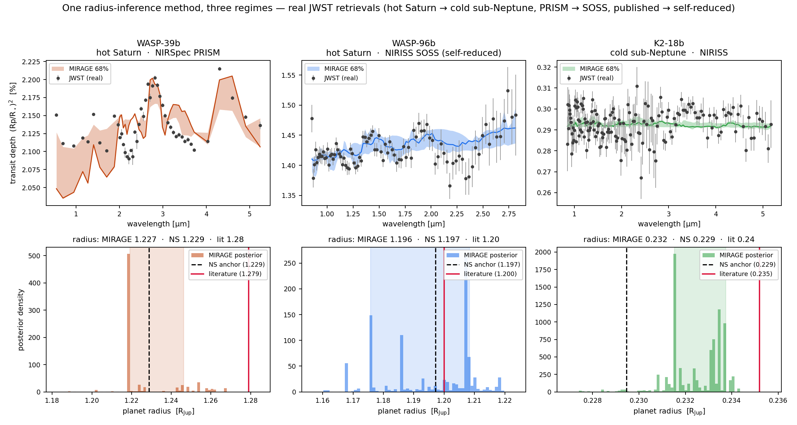
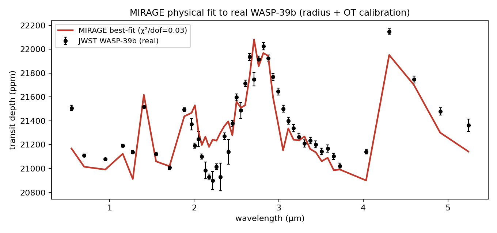

# MIRAGE
**Multi-Instrument Retrieval with Adaptive Generative Estimation**

[](https://doi.org/10.5281/zenodo.21924294)
[](LICENSE)


Simulation-to-real domain-adaptive atmospheric retrieval for JWST exoplanet transmission
spectroscopy. Preliminary results targeting the NeurIPS ML4PS workshop; full paper targeting
ICML 2027.

---

## What this is

Existing ML atmospheric retrievers train on simulated spectra and collapse on real JWST data.
MIRAGE is an end-to-end system — a multi-instrument transformer encoder, a noise-conditioned
flow-matching posterior (built on the fm4ar backbone), and an optimal-transport calibration
step — used to diagnose *why* the collapse happens and to close it on real data.

It attacks the sim-to-real gap from **two sides**: **domain adaptation** — structured
randomization of the training simulator so the encoder sees realistic instrument systematics
(Track 2); and **inference** — a radius-augmented posterior plus calibration against an
independent reference (Track 1). The two together are what make the retrieval hold up on real data.

The central real-data finding: on WASP-39b, the dominant sim-to-real gap was **not** forward-model
fidelity but a **radius / baseline degeneracy** — the network had no radius parameter, so it could
not absorb a ~3% transit-baseline mismatch and collapsed (importance-sampling ESS = 1). Adding the
planet radius to the inferred parameters, then calibrating against an independent nested-sampling
reference, produces a **physical, literature-consistent retrieval** of the real spectrum — which
then generalizes across three planets, two instruments, and both published and self-reduced data.

---

## Architecture



---

## Multi-target results

One radius-inference method, applied unchanged across three regimes — each retrieval validated
against an independent nested-sampling retrieval in the same parameter space:



| Planet | Class | Instrument | Data provenance | best-fit χ²/dof | radius (truth) RJup | coverage vs NS |
|--------|-------|------------|-----------------|-----------------|----------------------|----------------|
| WASP-39b | hot Saturn | NIRSpec PRISM | published | 0.06 | 1.23 (1.28) | 7/7 |
| WASP-96b | hot Saturn | **NIRISS SOSS** | **self-reduced** | 0.079 | 1.196 (1.20) | **7/7** |
| K2-18b | cold sub-Neptune | NIRISS | published | 0.20 | 0.233 (0.235) | 6/7 |

The method recovers the planet radius and a water-rich atmosphere across **planet class**
(hot Saturn ↔ cold sub-Neptune), **instrument** (PRISM ↔ SOSS), and **data provenance**
(published ↔ self-reduced). WASP-96b's spectrum is reduced here end-to-end from the raw MAST
ramps (JWST ERO 2734) with exoTEDRF + a batman light-curve fit — its 1.4 µm water feature is
recovered at 5.8σ.

---

## Key results

- **Radius parameterization fixes the fit.** Best-fit χ²/dof on real WASP-39b: **301 → 0.06**;
  radius and water abundance recovered, matching an independent TauREx nested-sampling retrieval.

  

- **Optimal-transport calibration.** Transporting the (overdispersed) flow posterior onto the
  nested-sampling reference gives a calibrated posterior with **7/7 parameters** inside the
  credible intervals (raw: 2/7), robust across error-budget and inflation choices.
- **Generalizes to N=3 targets.** WASP-96b (self-reduced NIRISS SOSS) and K2-18b (cold
  sub-Neptune) both give physical, NS-consistent retrievals — coverage 7/7 and 6/7.
- **Forward-model fidelity ruled out.** T-gradient, SO₂, and a full ExoMolOP R=15000 opacity set
  were each tested (nested-sampling-first) and did **not** flip the fit — the radius did.
- **Noise-conditioning is an honest, bounded result.** Covariance conditioning is a clean
  calibration win on the *synthetic* ABC benchmark (coverage 0.587 → 0.687, gain grows with noise)
  but does **not** transfer to a single real target, because real instrument noise is
  out-of-distribution. Reported as such.
- **Higher-resolution grid** improves the network's central accuracy (temperature recovery
  1581 K → 635 K, matching the reference) but not its precision — an amortization gap.

Full evidence: `Documentation/` (phase docs) and `Documentation/problems_and_decisions.md`
(decision log, D1–D13 / P3–P5). Figures regenerated by `scripts/make_figures.py` and
`scripts/fig_multitarget.py`.

---

## Domain adaptation

Closing the gap from the **input side**: training spectra are domain-randomized with structured
correlated noise, so the encoder sees the kind of instrument systematics it will meet on real
data. A **CycleGAN domain-translation** variant was tested as an alternative and did **not**
improve on structured randomization — a clean negative that rules out the added generative
complexity. Paired with the radius-inference and calibration fixes on the inference side, MIRAGE
treats the sim-to-real gap end to end rather than patching one half of it.

---

## Setup

Two environments (the ML stack and the TauREx forward model have incompatible numpy pins):

```bash
# inference / training (torch, numpy 1.26, fm4ar backbone)
conda create -n mirage python=3.11 && conda activate mirage
pip install -r requirements.txt && pip install -e .        # installs the `mirage` package + fm4ar

# TauREx3 forward model / nested-sampling reference (numpy 2)
conda create -n mirage-taurex python=3.11 && conda activate mirage-taurex
pip install taurex numba

# (optional) JWST reduction, for reproducing the WASP-96b spectrum from raw MAST
conda create -n mirage-reduce python=3.11 && conda activate mirage-reduce
pip install exotedrf batman-package
```

Training entry point (run from the repo root, no `PYTHONPATH` — both packages are pip-installed):

```bash
conda activate mirage && python scripts/train.py --experiment-dir configs/<name>
```

Multi-target retrieval / reduction pipeline:

```bash
# reduce WASP-96b from raw MAST -> transmission spectrum
conda run -n mirage-reduce python scripts/wasp96_setup_reduction.py
conda run -n mirage-reduce python scripts/wasp96_fit_lightcurves.py

# generate training data, train, evaluate on the real spectrum
python scripts/generate_training_data.py --planet wasp96 --tprofile radius --nbins 90 ...
python scripts/train.py --experiment-dir configs/noisecond_rad_nocond_wasp96
bash    scripts/run_wasp96_eval.sh
```

---

## Structure

```
Project/
├── mirage/            # the MIRAGE package: nn/ (encoder, covariance embedding),
│                      #   datasets/ (noise injection, real-JWST adapter), register.py
│                      #   (monkeypatches the pristine fm4ar factories — see P2-D8)
├── scripts/           # forward model (taurex_forward.py), retrieval (taurex_retrieve.py),
│                      #   data generation, real-data eval, OT calibration, figures,
│                      #   WASP-96b reduction (wasp96_setup_reduction / wasp96_fit_lightcurves)
├── configs/           # per-experiment YAML + checkpoints (checkpoints gitignored)
├── data/              # gitignored — downloaded / generated locally
├── figures/           # evaluation figures (regenerable)
├── Documentation/     # phase docs + problems_and_decisions.md (the decision log)
└── fm4ar/             # pristine upstream backbone, pinned; cloned locally (gitignored)
```

---

## Data & artifacts

Large data and model checkpoints are not stored in the repository (`data/` and `configs/**/model__*.pt`
are gitignored). Synthetic training data is generated locally via `scripts/generate_training_data.py`;
real JWST observations, published transmission spectra, and opacities are sourced as described in
`ACKNOWLEDGEMENTS.md`.

A companion **Zenodo record** ([10.5281/zenodo.21924294](https://doi.org/10.5281/zenodo.21924294))
archives the reproducible artifacts: the three reduced transmission spectra (including the
self-reduced WASP-96b spectrum), the trained FMPE models + configs, and the MIRAGE / nested-sampling
posterior samples behind the multi-target results.

---

## Status

| Phase | Focus | Status |
|-------|-------|--------|
| 0 | Environment + baseline reproduction | ✅ Complete |
| 1 | Multi-instrument transformer encoder | ✅ Complete |
| 2 | Noise conditioning (covariance embedding) | ✅ Complete (ABC calibration win) |
| 3 | Real JWST integration + calibration | ✅ Complete (radius fix + OT calibration) |
| 4 | Full evaluation + benchmark + figures | ✅ Complete |
| 5 | Multi-target (N=3) + higher-res + Zenodo release | ✅ Complete (paper draft next) |

**Tracks.** MIRAGE closes the sim-to-real gap from two sides, developed on separate branches and
merged at phase boundaries:
- **Track 1 — inference.** The radius-augmented flow-matching posterior, optimal-transport
  calibration, the multi-target (N=3) retrieval, and the end-to-end WASP-96b self-reduction.
- **Track 2 — domain adaptation & data.** Structured domain randomization, the JWST
  data-handling pipeline, and the CycleGAN-vs-randomization study (the input-side negative result).
